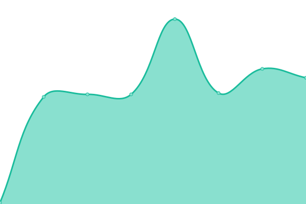

# [📈 Live Status](https://demo.upptime.js.org): <!--live status--> **🟧 Partial outage**

This repository contains the open-source uptime monitor and status page for [Upptime](https://upptime.js.org), powered by [Upptime](https://github.com/upptime/upptime).

With [Upptime](https://upptime.js.org), you can get your own unlimited and free uptime monitor and status page, powered entirely by a GitHub repository. We use [Issues](https://github.com/upptime/upptime/issues) as incident reports, [Actions](https://github.com/swuecho/upptime/actions) as uptime monitors, and [Pages](https://demo.upptime.js.org) for the status page.

<!--start: status pages-->
<!-- This summary is generated by Upptime (https://github.com/upptime/upptime) -->
<!-- Do not edit this manually, your changes will be overwritten -->
<!-- prettier-ignore -->
| URL | Status | History | Response Time | Uptime |
| --- | ------ | ------- | ------------- | ------ |
|  [Google](https://www.google.com) | 🟩 Up | [google.yml](https://github.com/swuecho/upptime/commits/HEAD/history/google.yml) | 

 131ms
     
 | 

<a href="https://swuecho.github.io/upptime/history/google">100.00%</a>
    

|  [BestQA](https://www.bestqa.net/) | 🟥 Down | [best-qa.yml](https://github.com/swuecho/upptime/commits/HEAD/history/best-qa.yml) | 

 2085ms
     
 | 

<a href="https://swuecho.github.io/upptime/history/best-qa">89.16%</a>
    

|  [BestQA_GO](https://www.bestqa.net/go/bestqa_dev/up) | 🟥 Down | [best-qa-go.yml](https://github.com/swuecho/upptime/commits/HEAD/history/best-qa-go.yml) | 

 726ms
     
 | 

<a href="https://swuecho.github.io/upptime/history/best-qa-go">92.48%</a>
    

<!--end: status pages-->

[**Visit our status website →**](https://swuecho.github.io/upptime)

## 📄 License

- Code: [MIT](./LICENSE) © [Upptime](https://upptime.js.org)
- Data in the `./history` directory: [Open Database License](https://opendatacommons.org/licenses/odbl/1-0/)
